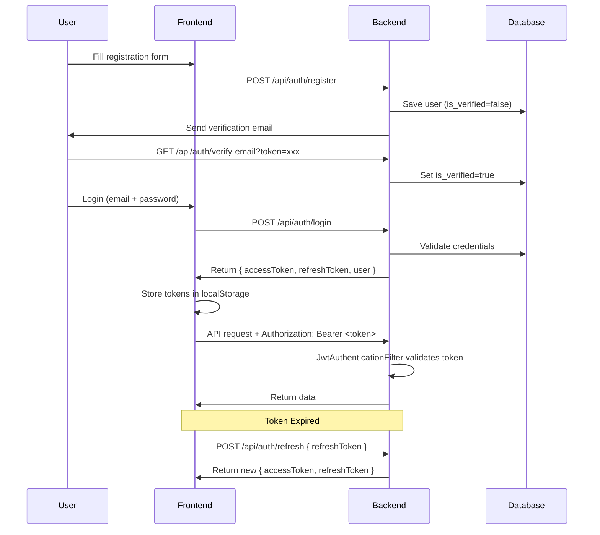
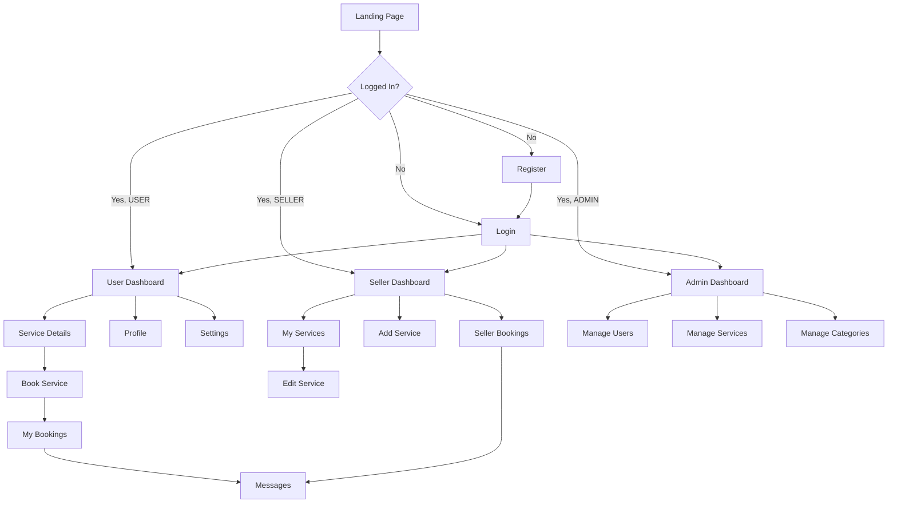

# Localyze — Full-Stack Implementation Plan

> **Discover Local. Support Local.**
> A platform for small/home-operated businesses to present their services and for users to discover nearby services within a configurable radius.

---

## Table of Contents

1. [Project Structure](#1-project-structure)
2. [Database Design](#2-database-design)
3. [API Design](#3-api-design)
4. [Authentication & Security](#4-authentication--security)
5. [Backend Implementation](#5-backend-implementation)
6. [Frontend Implementation](#6-frontend-implementation)
7. [Screens & Navigation](#7-screens--navigation)
8. [Search & Discovery](#8-search--discovery)
9. [Business Rules](#9-business-rules)
10. [Validation Rules](#10-validation-rules)
11. [Error Handling](#11-error-handling)
12. [File Uploads](#12-file-uploads)
13. [Admin Panel](#13-admin-panel)
14. [Third-Party Integrations](#14-third-party-integrations)
15. [Performance & Caching](#15-performance--caching)
16. [UI/UX Design System](#16-uiux-design-system)
17. [Logging](#17-logging)
18. [Deployment](#18-deployment)
19. [Execution Phases](#19-execution-phases)
20. [Acceptance Criteria](#20-acceptance-criteria)

---

## User Review Required

> [!IMPORTANT]
> **Google Maps API Key**: You will need a Google Maps JavaScript API key with the Maps JavaScript API and Geocoding API enabled. Please provide this key before Phase 5 (Frontend integration).

> [!IMPORTANT]
> **Razorpay API Keys**: You will need Razorpay key_id and key_secret for payment integration. Please provide these before implementing the payment module.

> [!IMPORTANT]
> **Cloudinary Credentials**: You will need Cloudinary cloud_name, api_key, and api_secret for image uploads. Please provide these before Phase 3 (File Upload service).

> [!IMPORTANT]
> **Email SMTP Configuration**: You will need SMTP credentials (e.g., Gmail app password) for JavaMail email verification. Please provide these before implementing email verification.

> [!WARNING]
> **Chat Feature**: The PRD mentions "after booking can chat with seller" in User Roles but lists "Real-time chat" as Out of Scope. I will implement a **simple message/inquiry system** (not real-time WebSocket chat) where users can send text messages to sellers after booking, and sellers can reply. This will use REST polling, not WebSocket. If you want full real-time chat, that would need WebSocket/STOMP which is significantly more complex.

> [!TIP]
> **Payment Integration**: Full Razorpay integration will be implemented — order creation, payment verification, and status tracking. Users will pay after booking confirmation.

## Open Questions

> [!IMPORTANT]
> 1. **Service Moderation**: Should new services be auto-published or require admin approval before appearing in search results? The PRD mentions "after approval (if moderation is required)" — please confirm.

> [!IMPORTANT]
> 2. **Business Profile Approval**: The PRD says "Business profile is approved" as a precondition. Should there be an admin approval workflow for new business registrations?

> [!IMPORTANT]
> 3. **Booking Flow**: What does a "booking" look like? Is it:
>    - (A) A simple service request (user sends date/time preference, seller confirms/rejects), or
>    - (B) A slot-based booking (seller defines available time slots, user picks one)?
>    - I will default to **(A)** unless you specify otherwise.

> [!IMPORTANT]
> 4. **Reviews**: Can users write reviews? The database design includes a `reviews` table but the PRD doesn't explicitly describe the review workflow. I will include review CRUD for users who have completed bookings.

> [!IMPORTANT]
> 5. **Radius Configuration**: The PRD mentions "within 1km" — should the radius be:
>    - Fixed at 1km?
>    - User-configurable (e.g., 1km, 2km, 5km, 10km dropdown)?
>    - I will default to **user-configurable** with 1km as the default.

---

## 1. Project Structure

```
e:\AntigravityLocalyzev2\
│
├── docs/
│   ├── PRD.md
│   ├── API.md
│   ├── DATABASE.md
│   └── USER_STORIES.md
│
├── frontend/                          # React + Vite + Tailwind
│   ├── index.html
│   ├── package.json
│   ├── vite.config.js
│   ├── tailwind.config.js
│   ├── postcss.config.js
│   ├── .env
│   ├── public/
│   │   └── favicon.svg
│   └── src/
│       ├── main.jsx
│       ├── App.jsx
│       ├── index.css                  # Tailwind imports + global styles
│       ├── assets/                    # Static assets (logo, images)
│       ├── components/                # Shared/reusable components
│       │   ├── ui/                    # Button, Input, Card, Modal, Toast, etc.
│       │   ├── layout/               # Navbar, Sidebar, Footer
│       │   └── map/                  # MapView, MapMarker
│       ├── pages/                     # Route-level page components
│       │   ├── Landing.jsx
│       │   ├── Login.jsx
│       │   ├── Register.jsx
│       │   ├── ForgotPassword.jsx
│       │   ├── ResetPassword.jsx
│       │   ├── VerifyEmail.jsx
│       │   ├── Dashboard.jsx          # User dashboard with map
│       │   ├── ServiceDetails.jsx
│       │   ├── BookingPage.jsx
│       │   ├── MyBookings.jsx
│       │   ├── Profile.jsx
│       │   ├── Settings.jsx
│       │   ├── seller/
│       │   │   ├── SellerDashboard.jsx
│       │   │   ├── AddService.jsx
│       │   │   ├── EditService.jsx
│       │   │   ├── MyServices.jsx
│       │   │   ├── SellerBookings.jsx
│       │   │   └── SellerProfile.jsx
│       │   ├── admin/
│       │   │   ├── AdminDashboard.jsx
│       │   │   ├── ManageUsers.jsx
│       │   │   ├── ManageServices.jsx
│       │   │   └── ManageCategories.jsx
│       │   └── NotFound.jsx
│       ├── hooks/                     # Custom React hooks
│       │   ├── useAuth.js
│       │   ├── useGeolocation.js
│       │   ├── useServices.js
│       │   └── useDebounce.js
│       ├── services/                  # API service layer (Axios)
│       │   ├── api.js                 # Axios instance with interceptors
│       │   ├── authService.js
│       │   ├── serviceService.js
│       │   ├── bookingService.js
│       │   ├── userService.js
│       │   ├── categoryService.js
│       │   ├── reviewService.js
│       │   └── uploadService.js
│       ├── contexts/                  # React Context providers
│       │   ├── AuthContext.jsx
│       │   ├── ThemeContext.jsx
│       │   └── LocationContext.jsx
│       └── utils/                     # Utility functions
│           ├── constants.js
│           ├── validators.js
│           ├── formatters.js
│           └── helpers.js
│
├── backend/                           # Spring Boot 3
│   ├── pom.xml
│   ├── src/
│   │   ├── main/
│   │   │   ├── java/com/localyze/
│   │   │   │   ├── LocalyzeApplication.java
│   │   │   │   ├── controller/
│   │   │   │   │   ├── AuthController.java
│   │   │   │   │   ├── UserController.java
│   │   │   │   │   ├── ServiceController.java
│   │   │   │   │   ├── BookingController.java
│   │   │   │   │   ├── CategoryController.java
│   │   │   │   │   ├── ReviewController.java
│   │   │   │   │   ├── UploadController.java
│   │   │   │   │   ├── AdminController.java
│   │   │   │   │   └── MessageController.java
│   │   │   │   ├── service/
│   │   │   │   │   ├── AuthService.java
│   │   │   │   │   ├── UserService.java
│   │   │   │   │   ├── ServiceService.java
│   │   │   │   │   ├── BookingService.java
│   │   │   │   │   ├── CategoryService.java
│   │   │   │   │   ├── ReviewService.java
│   │   │   │   │   ├── CloudinaryService.java
│   │   │   │   │   ├── EmailService.java
│   │   │   │   │   ├── AdminService.java
│   │   │   │   │   └── MessageService.java
│   │   │   │   ├── repository/
│   │   │   │   │   ├── UserRepository.java
│   │   │   │   │   ├── ServiceRepository.java
│   │   │   │   │   ├── BookingRepository.java
│   │   │   │   │   ├── CategoryRepository.java
│   │   │   │   │   ├── ReviewRepository.java
│   │   │   │   │   ├── ServiceImageRepository.java
│   │   │   │   │   └── MessageRepository.java
│   │   │   │   ├── entity/
│   │   │   │   │   ├── User.java
│   │   │   │   │   ├── ServiceEntity.java
│   │   │   │   │   ├── ServiceImage.java
│   │   │   │   │   ├── Booking.java
│   │   │   │   │   ├── Category.java
│   │   │   │   │   ├── Review.java
│   │   │   │   │   ├── Message.java
│   │   │   │   │   └── enums/
│   │   │   │   │       ├── Role.java
│   │   │   │   │       ├── BookingStatus.java
│   │   │   │   │       └── ServiceStatus.java
│   │   │   │   ├── dto/
│   │   │   │   │   ├── request/
│   │   │   │   │   │   ├── RegisterRequest.java
│   │   │   │   │   │   ├── LoginRequest.java
│   │   │   │   │   │   ├── ServiceRequest.java
│   │   │   │   │   │   ├── BookingRequest.java
│   │   │   │   │   │   ├── ReviewRequest.java
│   │   │   │   │   │   ├── PasswordResetRequest.java
│   │   │   │   │   │   ├── ForgotPasswordRequest.java
│   │   │   │   │   │   ├── MessageRequest.java
│   │   │   │   │   │   └── UpdateProfileRequest.java
│   │   │   │   │   └── response/
│   │   │   │   │       ├── AuthResponse.java
│   │   │   │   │       ├── UserResponse.java
│   │   │   │   │       ├── ServiceResponse.java
│   │   │   │   │       ├── BookingResponse.java
│   │   │   │   │       ├── ReviewResponse.java
│   │   │   │   │       ├── CategoryResponse.java
│   │   │   │   │       ├── MessageResponse.java
│   │   │   │   │       ├── PagedResponse.java
│   │   │   │   │       └── ApiResponse.java
│   │   │   │   ├── mapper/
│   │   │   │   │   ├── UserMapper.java
│   │   │   │   │   ├── ServiceMapper.java
│   │   │   │   │   ├── BookingMapper.java
│   │   │   │   │   └── ReviewMapper.java
│   │   │   │   ├── security/
│   │   │   │   │   ├── JwtTokenProvider.java
│   │   │   │   │   ├── JwtAuthenticationFilter.java
│   │   │   │   │   ├── CustomUserDetailsService.java
│   │   │   │   │   └── SecurityConfig.java
│   │   │   │   ├── exception/
│   │   │   │   │   ├── GlobalExceptionHandler.java
│   │   │   │   │   ├── ResourceNotFoundException.java
│   │   │   │   │   ├── BadRequestException.java
│   │   │   │   │   ├── UnauthorizedException.java
│   │   │   │   │   ├── DuplicateResourceException.java
│   │   │   │   │   └── FileUploadException.java
│   │   │   │   ├── config/
│   │   │   │   │   ├── CorsConfig.java
│   │   │   │   │   ├── CloudinaryConfig.java
│   │   │   │   │   └── AppConfig.java
│   │   │   │   └── util/
│   │   │   │       └── GeoUtils.java
│   │   │   └── resources/
│   │   │       ├── application.yml
│   │   │       └── application-dev.yml
│   │   └── test/
│   │       └── java/com/localyze/
│   │           ├── LocalyzeApplicationTests.java
│   │           ├── controller/
│   │           ├── service/
│   │           └── repository/
│   └── .mvn/
│
├── database/
│   ├── schema.sql
│   └── seed.sql
│
└── postman/
    └── Localyze.postman_collection.json
```

---

## 2. Database Design

### Entity Relationship Diagram

```mermaid
erDiagram
    USERS ||--o{ SERVICES : "owns"
    USERS ||--o{ BOOKINGS : "makes"
    USERS ||--o{ REVIEWS : "writes"
    USERS ||--o{ MESSAGES : "sends"
    SERVICES ||--o{ SERVICE_IMAGES : "has"
    SERVICES ||--o{ BOOKINGS : "receives"
    SERVICES ||--o{ REVIEWS : "has"
    SERVICES }o--|| CATEGORIES : "belongs_to"
    BOOKINGS ||--o{ MESSAGES : "has"

    USERS {
        bigint id PK
        varchar full_name
        varchar email UK
        varchar phone UK
        varchar password
        enum role "USER, SELLER, ADMIN"
        varchar profile_image_url
        varchar address
        decimal latitude
        decimal longitude
        boolean is_verified
        boolean is_active
        varchar verification_token
        varchar reset_token
        timestamp reset_token_expiry
        timestamp created_at
        timestamp updated_at
    }

    CATEGORIES {
        bigint id PK
        varchar name UK
        varchar description
        varchar icon_url
        boolean is_active
        timestamp created_at
    }

    SERVICES {
        bigint id PK
        bigint seller_id FK
        bigint category_id FK
        varchar title
        text description
        decimal price
        varchar price_unit "per_hour, per_visit, fixed"
        varchar address
        decimal latitude
        decimal longitude
        varchar availability "Mon-Fri 9AM-6PM"
        enum status "ACTIVE, INACTIVE, PENDING, REJECTED"
        decimal avg_rating
        int total_reviews
        boolean is_deleted
        timestamp created_at
        timestamp updated_at
    }

    SERVICE_IMAGES {
        bigint id PK
        bigint service_id FK
        varchar image_url
        int display_order
        timestamp created_at
    }

    BOOKINGS {
        bigint id PK
        bigint user_id FK
        bigint service_id FK
        bigint seller_id FK
        enum status "PENDING, CONFIRMED, IN_PROGRESS, COMPLETED, CANCELLED"
        date booking_date
        varchar time_slot
        text notes
        text cancellation_reason
        timestamp created_at
        timestamp updated_at
    }

    REVIEWS {
        bigint id PK
        bigint user_id FK
        bigint service_id FK
        bigint booking_id FK UK
        int rating "1-5"
        text comment
        boolean is_deleted
        timestamp created_at
        timestamp updated_at
    }

    MESSAGES {
        bigint id PK
        bigint booking_id FK
        bigint sender_id FK
        bigint receiver_id FK
        text content
        boolean is_read
        timestamp created_at
    }
```

### Table Details

#### `users`
| Column | Type | Constraints |
|--------|------|-------------|
| id | BIGINT | PK, AUTO_INCREMENT |
| full_name | VARCHAR(100) | NOT NULL |
| email | VARCHAR(255) | NOT NULL, UNIQUE |
| phone | VARCHAR(15) | NOT NULL, UNIQUE |
| password | VARCHAR(255) | NOT NULL |
| role | ENUM('USER','SELLER','ADMIN') | NOT NULL, DEFAULT 'USER' |
| profile_image_url | VARCHAR(500) | NULLABLE |
| address | VARCHAR(500) | NULLABLE |
| latitude | DECIMAL(10,8) | NULLABLE |
| longitude | DECIMAL(11,8) | NULLABLE |
| is_verified | BOOLEAN | DEFAULT FALSE |
| is_active | BOOLEAN | DEFAULT TRUE |
| verification_token | VARCHAR(255) | NULLABLE |
| reset_token | VARCHAR(255) | NULLABLE |
| reset_token_expiry | TIMESTAMP | NULLABLE |
| created_at | TIMESTAMP | DEFAULT CURRENT_TIMESTAMP |
| updated_at | TIMESTAMP | ON UPDATE CURRENT_TIMESTAMP |

**Indexes**: `idx_users_email`, `idx_users_phone`, `idx_users_role`

#### `categories`
| Column | Type | Constraints |
|--------|------|-------------|
| id | BIGINT | PK, AUTO_INCREMENT |
| name | VARCHAR(100) | NOT NULL, UNIQUE |
| description | VARCHAR(500) | NULLABLE |
| icon_url | VARCHAR(500) | NULLABLE |
| is_active | BOOLEAN | DEFAULT TRUE |
| created_at | TIMESTAMP | DEFAULT CURRENT_TIMESTAMP |

#### `services`
| Column | Type | Constraints |
|--------|------|-------------|
| id | BIGINT | PK, AUTO_INCREMENT |
| seller_id | BIGINT | FK → users(id), NOT NULL |
| category_id | BIGINT | FK → categories(id), NOT NULL |
| title | VARCHAR(200) | NOT NULL |
| description | TEXT | NOT NULL |
| price | DECIMAL(10,2) | NOT NULL |
| price_unit | VARCHAR(20) | DEFAULT 'fixed' |
| address | VARCHAR(500) | NOT NULL |
| latitude | DECIMAL(10,8) | NOT NULL |
| longitude | DECIMAL(11,8) | NOT NULL |
| availability | VARCHAR(200) | NULLABLE |
| status | ENUM('ACTIVE','INACTIVE','PENDING','REJECTED') | DEFAULT 'ACTIVE' |
| avg_rating | DECIMAL(2,1) | DEFAULT 0.0 |
| total_reviews | INT | DEFAULT 0 |
| is_deleted | BOOLEAN | DEFAULT FALSE |
| created_at | TIMESTAMP | DEFAULT CURRENT_TIMESTAMP |
| updated_at | TIMESTAMP | ON UPDATE CURRENT_TIMESTAMP |

**Indexes**: `idx_services_seller`, `idx_services_category`, `idx_services_status`, `idx_services_location` (latitude, longitude), `idx_services_price`

#### `service_images`
| Column | Type | Constraints |
|--------|------|-------------|
| id | BIGINT | PK, AUTO_INCREMENT |
| service_id | BIGINT | FK → services(id), NOT NULL |
| image_url | VARCHAR(500) | NOT NULL |
| display_order | INT | DEFAULT 0 |
| created_at | TIMESTAMP | DEFAULT CURRENT_TIMESTAMP |

#### `bookings`
| Column | Type | Constraints |
|--------|------|-------------|
| id | BIGINT | PK, AUTO_INCREMENT |
| user_id | BIGINT | FK → users(id), NOT NULL |
| service_id | BIGINT | FK → services(id), NOT NULL |
| seller_id | BIGINT | FK → users(id), NOT NULL |
| status | ENUM('PENDING','CONFIRMED','IN_PROGRESS','COMPLETED','CANCELLED') | DEFAULT 'PENDING' |
| booking_date | DATE | NOT NULL |
| time_slot | VARCHAR(50) | NULLABLE |
| notes | TEXT | NULLABLE |
| cancellation_reason | TEXT | NULLABLE |
| created_at | TIMESTAMP | DEFAULT CURRENT_TIMESTAMP |
| updated_at | TIMESTAMP | ON UPDATE CURRENT_TIMESTAMP |

**Indexes**: `idx_bookings_user`, `idx_bookings_seller`, `idx_bookings_service`, `idx_bookings_status`

#### `reviews`
| Column | Type | Constraints |
|--------|------|-------------|
| id | BIGINT | PK, AUTO_INCREMENT |
| user_id | BIGINT | FK → users(id), NOT NULL |
| service_id | BIGINT | FK → services(id), NOT NULL |
| booking_id | BIGINT | FK → bookings(id), UNIQUE, NOT NULL |
| rating | INT | NOT NULL, CHECK(1-5) |
| comment | TEXT | NULLABLE |
| is_deleted | BOOLEAN | DEFAULT FALSE |
| created_at | TIMESTAMP | DEFAULT CURRENT_TIMESTAMP |
| updated_at | TIMESTAMP | ON UPDATE CURRENT_TIMESTAMP |

**Indexes**: `idx_reviews_service`, `idx_reviews_user`

#### `messages`
| Column | Type | Constraints |
|--------|------|-------------|
| id | BIGINT | PK, AUTO_INCREMENT |
| booking_id | BIGINT | FK → bookings(id), NOT NULL |
| sender_id | BIGINT | FK → users(id), NOT NULL |
| receiver_id | BIGINT | FK → users(id), NOT NULL |
| content | TEXT | NOT NULL |
| is_read | BOOLEAN | DEFAULT FALSE |
| created_at | TIMESTAMP | DEFAULT CURRENT_TIMESTAMP |

**Indexes**: `idx_messages_booking`, `idx_messages_sender`, `idx_messages_receiver`

---

## 3. API Design

### Auth APIs

| Method | Endpoint | Auth | Description |
|--------|----------|------|-------------|
| POST | `/api/auth/register` | No | Register a new user/seller |
| POST | `/api/auth/login` | No | Login and get JWT |
| POST | `/api/auth/refresh` | JWT | Refresh access token |
| GET | `/api/auth/verify-email?token=` | No | Verify email address |
| POST | `/api/auth/forgot-password` | No | Send password reset email |
| POST | `/api/auth/reset-password` | No | Reset password with token |

### User APIs

| Method | Endpoint | Auth | Description |
|--------|----------|------|-------------|
| GET | `/api/users/me` | JWT | Get current user profile |
| PUT | `/api/users/me` | JWT | Update current user profile |
| PUT | `/api/users/me/password` | JWT | Change password |
| PUT | `/api/users/me/location` | JWT | Update user location |
| DELETE | `/api/users/me` | JWT | Deactivate own account |

### Service APIs

| Method | Endpoint | Auth | Description |
|--------|----------|------|-------------|
| GET | `/api/services` | No | List/search services (with filters) |
| GET | `/api/services/{id}` | No | Get service details |
| POST | `/api/services` | JWT(SELLER) | Create a new service |
| PUT | `/api/services/{id}` | JWT(SELLER) | Update a service |
| DELETE | `/api/services/{id}` | JWT(SELLER) | Soft-delete a service |
| GET | `/api/services/nearby` | No | Get services near coordinates |
| GET | `/api/services/seller/{sellerId}` | No | Get services by seller |
| GET | `/api/services/my` | JWT(SELLER) | Get own services |

**Query Parameters for `/api/services` and `/api/services/nearby`**:
```
?lat=18.5&lng=73.8&radius=1.0
&category=plumber
&search=keyword
&minPrice=100&maxPrice=5000
&minRating=3.0
&sortBy=distance|price|rating
&sortDir=asc|desc
&page=0&size=12
```

### Booking APIs

| Method | Endpoint | Auth | Description |
|--------|----------|------|-------------|
| POST | `/api/bookings` | JWT(USER) | Create a booking |
| GET | `/api/bookings/my` | JWT(USER) | Get user's bookings |
| GET | `/api/bookings/seller` | JWT(SELLER) | Get seller's bookings |
| GET | `/api/bookings/{id}` | JWT | Get booking details |
| PUT | `/api/bookings/{id}/status` | JWT | Update booking status |
| PUT | `/api/bookings/{id}/cancel` | JWT | Cancel a booking |

### Review APIs

| Method | Endpoint | Auth | Description |
|--------|----------|------|-------------|
| POST | `/api/reviews` | JWT(USER) | Write a review (after completed booking) |
| GET | `/api/reviews/service/{serviceId}` | No | Get reviews for a service |
| PUT | `/api/reviews/{id}` | JWT(USER) | Edit own review |
| DELETE | `/api/reviews/{id}` | JWT(USER) | Delete own review |

### Message APIs

| Method | Endpoint | Auth | Description |
|--------|----------|------|-------------|
| POST | `/api/messages` | JWT | Send a message (within a booking) |
| GET | `/api/messages/booking/{bookingId}` | JWT | Get messages for a booking |
| PUT | `/api/messages/{id}/read` | JWT | Mark message as read |
| GET | `/api/messages/unread-count` | JWT | Get unread message count |

### Category APIs

| Method | Endpoint | Auth | Description |
|--------|----------|------|-------------|
| GET | `/api/categories` | No | List all active categories |
| POST | `/api/categories` | JWT(ADMIN) | Create category |
| PUT | `/api/categories/{id}` | JWT(ADMIN) | Update category |
| DELETE | `/api/categories/{id}` | JWT(ADMIN) | Deactivate category |

### Upload APIs

| Method | Endpoint | Auth | Description |
|--------|----------|------|-------------|
| POST | `/api/upload/image` | JWT | Upload single image to Cloudinary |
| POST | `/api/upload/images` | JWT | Upload multiple images (max 5) |
| DELETE | `/api/upload/image` | JWT | Delete an image from Cloudinary |

### Admin APIs

| Method | Endpoint | Auth | Description |
|--------|----------|------|-------------|
| GET | `/api/admin/users` | JWT(ADMIN) | List all users (paginated) |
| PUT | `/api/admin/users/{id}/status` | JWT(ADMIN) | Activate/deactivate user |
| DELETE | `/api/admin/users/{id}` | JWT(ADMIN) | Remove user |
| GET | `/api/admin/services` | JWT(ADMIN) | List all services |
| PUT | `/api/admin/services/{id}/status` | JWT(ADMIN) | Approve/reject service |
| DELETE | `/api/admin/services/{id}` | JWT(ADMIN) | Remove service |
| GET | `/api/admin/bookings` | JWT(ADMIN) | List all bookings |
| GET | `/api/admin/stats` | JWT(ADMIN) | Get basic stats counts |

---

## 4. Authentication & Security

### Authentication Flow



### Security Configuration

| Feature | Implementation |
|---------|---------------|
| Password Hashing | BCrypt (Spring Security) |
| JWT Access Token | 15 minutes expiry |
| JWT Refresh Token | 7 days expiry |
| CSRF | Disabled (stateless JWT) |
| CORS | Configured for frontend origin (`http://localhost:5173`) |
| XSS | Input sanitization + Content-Security-Policy headers |
| SQL Injection | JPA parameterized queries (Hibernate) |
| Rate Limiting | Custom filter: 100 requests/minute per IP for auth endpoints |
| Role-Based Access | `@PreAuthorize` annotations on controller methods |
| Remember Me | Longer-lived refresh token (30 days) when checked |

### Role Permissions Matrix

| Resource | USER | SELLER | ADMIN |
|----------|------|--------|-------|
| View services | ✅ | ✅ | ✅ |
| Book a service | ✅ | ❌ | ❌ |
| Write a review | ✅ | ❌ | ❌ |
| Create service | ❌ | ✅ | ✅ |
| Edit own service | ❌ | ✅ | ✅ |
| Manage bookings (seller) | ❌ | ✅ | ✅ |
| Admin panel | ❌ | ❌ | ✅ |
| Manage users | ❌ | ❌ | ✅ |
| Remove services | ❌ | ❌ | ✅ |

---

## 5. Backend Implementation

### Maven Dependencies (pom.xml)

```xml
<!-- Core -->
spring-boot-starter-web
spring-boot-starter-security
spring-boot-starter-data-jpa
spring-boot-starter-validation
spring-boot-starter-mail

<!-- Database -->
mysql-connector-j

<!-- JWT -->
io.jsonwebtoken:jjwt-api:0.12.6
io.jsonwebtoken:jjwt-impl:0.12.6
io.jsonwebtoken:jjwt-jackson:0.12.6

<!-- Cloudinary -->
com.cloudinary:cloudinary-http45:1.38.0

<!-- Utilities -->
lombok
spring-boot-starter-test
```

### Key Implementation Patterns

1. **Constructor Injection**: All services use `@RequiredArgsConstructor` (Lombok)
2. **DTO Pattern**: Request/Response DTOs separate API layer from entities
3. **Mapper Classes**: Manual mapping (no MapStruct for simplicity)
4. **Bean Validation**: `@Valid` on request bodies, Jakarta validation annotations on DTOs
5. **Global Exception Handler**: `@RestControllerAdvice` returning standardized `ApiResponse`
6. **Soft Delete**: Services and reviews use `is_deleted` flag
7. **Audit Fields**: `created_at` and `updated_at` on all entities via `@PrePersist`/`@PreUpdate`

### Geo-Search Strategy

For nearby service search, I'll use the **Haversine formula** in a native SQL query:

```sql
SELECT *, (
  6371 * acos(
    cos(radians(:lat)) * cos(radians(latitude)) *
    cos(radians(longitude) - radians(:lng)) +
    sin(radians(:lat)) * sin(radians(latitude))
  )
) AS distance
FROM services
WHERE status = 'ACTIVE' AND is_deleted = false
HAVING distance < :radius
ORDER BY distance
```

This is efficient for the expected scale (< 100K services). For larger scale, MySQL spatial indexes (`SPATIAL INDEX` on `POINT` geometry) would be the upgrade path.

---

## 6. Frontend Implementation

### Tech Setup

| Tool | Version | Purpose |
|------|---------|---------|
| React | 18+ | UI framework |
| Vite | 5+ | Build tool |
| Tailwind CSS | 3 | Utility-first CSS |
| React Router | 6 | Client-side routing |
| Axios | 1.x | HTTP client |
| @react-google-maps/api | Latest | Google Maps integration |
| react-hot-toast | Latest | Toast notifications |
| lucide-react | Latest | Flat icons |
| react-dropzone | Latest | File upload UI |

### Axios Configuration

```javascript
// JWT interceptor: auto-attach Authorization header
// Response interceptor: on 401, attempt refresh token
// On refresh failure: redirect to /login
```

### State Management

- **AuthContext**: User info, JWT tokens, login/logout/register functions
- **ThemeContext**: Dark mode toggle, persisted in localStorage
- **LocationContext**: User geolocation (lat/lng), address

### Protected Routes

```jsx
<Route element={<ProtectedRoute roles={['USER']} />}>
  {/* User-only routes */}
</Route>
<Route element={<ProtectedRoute roles={['SELLER']} />}>
  {/* Seller-only routes */}
</Route>
<Route element={<ProtectedRoute roles={['ADMIN']} />}>
  {/* Admin-only routes */}
</Route>
```

---

## 7. Screens & Navigation

### Navigation Flow



### Screen Details

| # | Page | URL | Key Components |
|---|------|-----|----------------|
| 1 | Landing | `/` | Hero, category carousel, featured services, CTA |
| 2 | Login | `/login` | Email + password form, forgot password link |
| 3 | Register | `/register` | Registration form with role selector (User/Seller) |
| 4 | Forgot Password | `/forgot-password` | Email input to request reset |
| 5 | Reset Password | `/reset-password?token=` | New password form |
| 6 | Verify Email | `/verify-email?token=` | Auto-verification with status |
| 7 | User Dashboard | `/dashboard` | Map with nearby services, service grid, filters, search |
| 8 | Service Details | `/services/:id` | Images, description, price, reviews, book button, seller info |
| 9 | Booking Page | `/book/:serviceId` | Date picker, time, notes, confirm button |
| 10 | My Bookings | `/my-bookings` | Booking list with status tabs, cancel option |
| 11 | Messages | `/bookings/:bookingId/messages` | Chat-like message thread |
| 12 | Profile | `/profile` | View/edit profile, upload avatar |
| 13 | Settings | `/settings` | Change password, location, preferences, dark mode |
| 14 | Seller Dashboard | `/seller/dashboard` | Stats, recent bookings, service overview |
| 15 | Add Service | `/seller/services/new` | Service creation form with image upload |
| 16 | Edit Service | `/seller/services/:id/edit` | Pre-filled service edit form |
| 17 | My Services | `/seller/services` | List of seller's services with status |
| 18 | Seller Bookings | `/seller/bookings` | Incoming bookings with accept/reject |
| 19 | Seller Profile | `/seller/profile` | Business profile management |
| 20 | Admin Dashboard | `/admin` | Stats cards, quick actions |
| 21 | Manage Users | `/admin/users` | User table with search, filter, activate/deactivate |
| 22 | Manage Services | `/admin/services` | Service table with approve/reject/delete |
| 23 | Manage Categories | `/admin/categories` | Category CRUD |
| 24 | 404 Not Found | `*` | Friendly error page with back button |

### Screen States

Each screen implements:
- **Loading**: Skeleton loaders / shimmer effect
- **Empty**: Friendly illustration + message (e.g., "No services found nearby")
- **Error**: Error message with retry button
- **Success**: Data display with animations

---

## 8. Search & Discovery

### Search Features

| Feature | Implementation |
|---------|---------------|
| **Location-based** | GPS coordinates from browser Geolocation API |
| **Radius filter** | User-configurable: 0.5km, 1km, 2km, 5km, 10km (default: 1km) |
| **Text search** | Search by service name, description (LIKE query) |
| **Category filter** | Dropdown/chips: plumber, electrician, tailor, etc. |
| **Price range** | Min/max price slider |
| **Rating filter** | Minimum rating (1-5 stars) |
| **Sorting** | Distance (default), Price (low→high, high→low), Rating |
| **Pagination** | 12 items per page, infinite scroll or page numbers |

### Map Integration

- **Google Maps JavaScript API** with `@react-google-maps/api`
- User location shown as a blue dot with pulsing animation
- Nearby services shown as pin markers with service icon
- Clicking a marker opens an info window with service name, rating, distance
- Radius circle drawn on map (adjustable)
- Map and list view synchronized

---

## 9. Business Rules

| Rule | Details |
|------|---------|
| Users can edit reviews | ✅ Within 7 days of posting |
| Users can delete reviews | ✅ Soft delete |
| Users can cancel bookings | ✅ Only if status is PENDING or CONFIRMED |
| Sellers can reject bookings | ✅ Only if status is PENDING |
| Sellers can mark as completed | ✅ Only if status is IN_PROGRESS |
| Multiple bookings simultaneously | ✅ Different time slots allowed |
| Max image upload size | 5 MB per image |
| Max images per service | 5 |
| Service description min length | 50 characters |
| Service price | Must be > ₹0 |
| Review requirement | Must have a completed booking |
| One review per booking | ✅ Enforced by UNIQUE constraint |
| Booking cancellation | Free cancellation before confirmation |

---

## 10. Validation Rules

### Password
- Minimum 8 characters
- At least 1 uppercase letter
- At least 1 lowercase letter
- At least 1 digit
- At least 1 special character (`@#$%^&+=!`)

### Email
- RFC 5322 format validation
- Must be unique in database

### Phone
- Exactly 10 digits
- Only numeric characters
- Must be unique in database

### Full Name
- 3–100 characters
- Alphabets and spaces only

### Service Title
- 5–200 characters

### Service Description
- Minimum 50 characters

### Service Price
- Greater than 0
- Maximum 2 decimal places

### Rating
- Integer 1–5

### Review Comment
- Maximum 1000 characters

---

## 11. Error Handling

### API Error Response Format

```json
{
  "success": false,
  "message": "Validation failed",
  "errors": {
    "email": "Email is already registered",
    "password": "Password must be at least 8 characters"
  },
  "timestamp": "2026-06-29T21:00:00Z",
  "status": 400
}
```

### HTTP Status Codes

| Code | Usage |
|------|-------|
| 200 | Success |
| 201 | Created |
| 400 | Bad Request / Validation Error |
| 401 | Unauthorized / Invalid token |
| 403 | Forbidden / Insufficient role |
| 404 | Resource not found |
| 409 | Conflict (duplicate email/phone) |
| 413 | File too large |
| 429 | Rate limit exceeded |
| 500 | Internal server error |

### Frontend Error Display

| Error Type | Display |
|------------|---------|
| Validation | Inline field errors (red text below field) |
| API errors | Toast notification (top-right) |
| Network errors | Full-screen retry overlay |
| 404 | Custom 404 page |
| 500 | "Something went wrong" page with retry |
| Auth errors | Redirect to login with message |

---

## 12. File Uploads

| Aspect | Details |
|--------|---------|
| Provider | Cloudinary |
| Image formats | JPG, PNG, WebP |
| Max size | 5 MB per image |
| Max count | 5 per service, 1 for profile |
| Compression | Cloudinary auto-quality transformation |
| Upload flow | Frontend → Backend → Cloudinary → Return URL |
| Deletion | Backend deletes from Cloudinary by public_id |

---

## 13. Admin Panel

### Admin Capabilities

| Feature | Implementation |
|---------|---------------|
| Manage Users | List, search, filter by role, activate/deactivate, delete |
| Manage Services | List, search, approve/reject pending, remove |
| Manage Categories | CRUD operations |
| View Basic Stats | Total users, services, bookings (count cards) |
| Suspend Accounts | Set `is_active = false` |

> [!NOTE]
> Full analytics dashboard is out of scope per PRD. Basic stat counts (total users, sellers, services, bookings) will be provided.

---

## 14. Third-Party Integrations

| Service | Purpose | Integration |
|---------|---------|-------------|
| Google Maps JS API | Map display, geocoding, nearby search | `@react-google-maps/api` in React |
| Cloudinary | Image upload, compression, CDN | Backend SDK (`cloudinary-http45`) |
| JavaMail (SMTP) | Email verification, password reset | `spring-boot-starter-mail` |
| Razorpay | Payment (scaffolded only) | Placeholder in backend |

---

## 15. Performance & Caching

| Aspect | Strategy |
|--------|----------|
| Expected users | ~1,000 initially |
| Max response time | < 500ms for API calls |
| Pagination | 12 items per page (backend Spring `Pageable`) |
| Lazy loading | Images lazy-loaded with `loading="lazy"` |
| Frontend code splitting | React.lazy + Suspense for route-level splitting |
| Image optimization | Cloudinary auto-format + WebP |
| Database indexes | On all FK columns and search columns |

---

## 16. UI/UX Design System

### Theme

| Property | Value |
|----------|-------|
| Style | Glassmorphism with blue tint |
| Primary | `#3B82F6` (Blue-500) |
| Primary Dark | `#1E40AF` (Blue-800) |
| Primary Light | `#DBEAFE` (Blue-100) |
| Background Light | `#F0F9FF` (Sky-50) |
| Background Dark | `#0F172A` (Slate-900) |
| Glass Effect | `backdrop-blur-xl bg-white/20 border border-white/30` |
| Dark Mode Glass | `backdrop-blur-xl bg-slate-800/40 border border-slate-700/50` |
| Typography | Inter (Google Fonts) — clean, modern sans-serif |
| Icons | Lucide React (flat style) |
| Border Radius | 16px (large), 12px (medium), 8px (small) |
| Shadows | Soft blue-tinted shadows |
| Animations | Subtle: 200-300ms transitions, fade-in, slide-up |

### Dark Mode
- Toggle in navbar
- Persisted in localStorage
- Tailwind `darkMode: 'class'` strategy

### Responsive Breakpoints
- Mobile: < 640px
- Tablet: 640px – 1024px
- Desktop: > 1024px

---

## 17. Logging

| What | How |
|------|-----|
| Authentication events | SLF4J INFO: login success/failure, registration |
| API errors | SLF4J ERROR: exception details, stack traces |
| CRUD operations | SLF4J INFO: service created/updated/deleted |
| Admin actions | SLF4J WARN: user suspended, service removed |
| Request tracing | Request ID in headers for correlation |

---

## 18. Deployment

| Component | Environment |
|-----------|-------------|
| Frontend | `npm run dev` → localhost:5173 |
| Backend | `mvn spring-boot:run` → localhost:8080 |
| Database | MySQL local → localhost:3306 |

---

## 19. Execution Phases

### Phase 1: Foundation (Database + Project Setup)
1. Create project folder structure
2. Create `schema.sql` with all tables
3. Create `seed.sql` with categories and admin user
4. Initialize Spring Boot project with Maven (`pom.xml`)
5. Configure `application.yml` (MySQL, JPA, JWT, Mail, Cloudinary)
6. Create all entity classes
7. Create all repository interfaces
8. Create enum classes
9. Initialize Vite + React project
10. Configure Tailwind CSS with custom theme
11. Set up project-level configs (ESLint, env files)

### Phase 2: Authentication (Backend)
1. Create DTOs (RegisterRequest, LoginRequest, AuthResponse)
2. Implement JwtTokenProvider
3. Implement CustomUserDetailsService
4. Configure SecurityConfig (Spring Security 6 filter chain)
5. Implement JwtAuthenticationFilter
6. Implement AuthService (register, login, verify, forgot/reset password)
7. Implement EmailService (JavaMail)
8. Implement AuthController
9. Implement GlobalExceptionHandler
10. Create CorsConfig

### Phase 3: Core Backend Services
1. Implement CategoryService + Controller
2. Implement ServiceService + Controller (CRUD + geo-search)
3. Implement BookingService + Controller
4. Implement ReviewService + Controller
5. Implement MessageService + Controller
6. Implement CloudinaryService + UploadController
7. Implement AdminService + AdminController
8. Implement UserService + UserController
9. Create all mapper classes

### Phase 4: Frontend Foundation
1. Set up React Router with all routes
2. Build design system components (Button, Input, Card, Modal, Toast, etc.)
3. Implement AuthContext + login/register/logout
4. Build Navbar + Sidebar + Footer (layout)
5. Implement Axios service layer with interceptors
6. Implement ThemeContext (dark mode)
7. Implement LocationContext (geolocation)
8. Build ProtectedRoute component

### Phase 5: Frontend Pages — Auth & User
1. Landing page (hero, categories, CTA)
2. Login page
3. Register page (with role selection)
4. Forgot Password page
5. Reset Password page
6. Verify Email page
7. User Dashboard (map + service grid + filters)
8. Service Details page
9. Booking page
10. My Bookings page
11. Messages page
12. Profile page
13. Settings page

### Phase 6: Frontend Pages — Seller & Admin
1. Seller Dashboard
2. Add Service page (with image upload)
3. Edit Service page
4. My Services page
5. Seller Bookings page
6. Admin Dashboard
7. Manage Users page
8. Manage Services page
9. Manage Categories page
10. 404 page

### Phase 7: Polish & Verification
1. Test all API endpoints (Postman collection)
2. Test all frontend flows end-to-end
3. Responsive design verification
4. Dark mode verification
5. Error handling verification
6. Create documentation files (PRD.md, API.md, DATABASE.md)
7. Create Postman collection

---

## 20. Acceptance Criteria

| Feature | Accepted When |
|---------|---------------|
| **User Registration** | ✅ Valid registration works ✅ Duplicate email/phone rejected ✅ Verification email sent ✅ Unverified users blocked |
| **User Login** | ✅ Valid credentials return JWT ✅ Invalid credentials return 401 ✅ Token refresh works ✅ Redirects to correct dashboard |
| **Service Creation** | ✅ Seller can create with images ✅ Validation errors shown ✅ Service appears in search |
| **Nearby Search** | ✅ Map shows user location ✅ Services within radius displayed ✅ Distance calculated correctly ✅ Filters work |
| **Booking** | ✅ User can book a service ✅ Seller receives booking ✅ Status updates work ✅ Cancellation works |
| **Reviews** | ✅ Only after completed booking ✅ One review per booking ✅ Rating updates service average |
| **Messages** | ✅ Messages sent within booking ✅ Read status tracked ✅ Unread count displayed |
| **Admin Panel** | ✅ Admin can manage users ✅ Admin can manage services ✅ Admin can manage categories |
| **Dark Mode** | ✅ Toggle works ✅ Persists across sessions ✅ All pages styled correctly |
| **Responsive** | ✅ Works on mobile, tablet, desktop ✅ Map responsive ✅ Navigation adapts |

---

## Proposed Changes Summary

### [NEW] `database/` — Schema and seed data
- `schema.sql`: All 7 tables with indexes and constraints
- `seed.sql`: Categories, admin user

### [NEW] `backend/` — Spring Boot 3 application
- 9 Controllers, 10 Services, 7 Repositories
- 15 Entities/Enums, 17 DTOs
- Security layer (JWT + Spring Security 6)
- Global exception handling
- Cloudinary + Email integrations

### [NEW] `frontend/` — React + Vite + Tailwind
- 24 pages across User, Seller, and Admin roles
- Reusable component library (glassmorphism design)
- Google Maps integration
- Dark mode support
- Axios with JWT interceptors

### [NEW] `docs/` — Documentation
- API reference, database schema, user stories

### [NEW] `postman/` — API testing collection

---

## Verification Plan

### Automated Tests
```bash
# Backend
cd backend && mvn test

# Frontend
cd frontend && npm run build  # Verify no build errors
```

### Manual Verification
1. Start MySQL, backend, and frontend
2. Register a user → verify email → login
3. Register a seller → create a service with images
4. As user: search nearby services, view details, book a service
5. As seller: confirm booking, mark as completed
6. As user: write a review
7. As admin: manage users and services
8. Test dark mode toggle
9. Test responsive layouts (mobile/tablet/desktop)
10. Test all error scenarios (invalid inputs, expired tokens, 404s)
